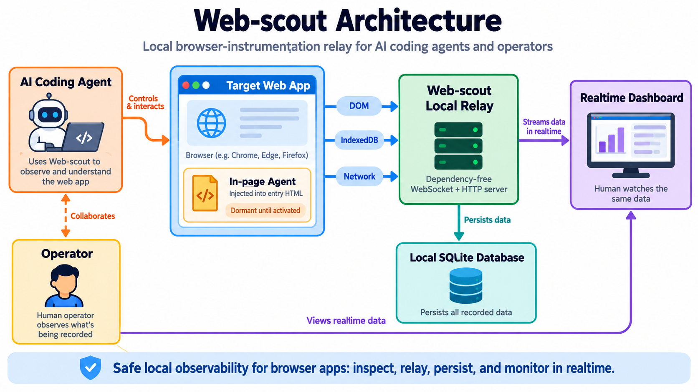

# Web-scout



**Give your AI coding agent eyes and hands in a real browser tab.**

Web-scout is a small, dependency-free tool that lets Claude Code, Codex CLI,
or any other coding agent with shell access read and write the DOM,
IndexedDB, and network traffic of a real, already-open browser tab - and
prove what actually happened, instead of just claiming it worked.

> Deep technical detail (how it works internally, every command's design
> rationale, dashboard implementation history) lives in
> [`docs/web-scout-architecture.md`](./docs/web-scout-architecture.md). This
> file is the quickstart and everyday command reference.

## The problem this solves

An AI agent editing your frontend code has no real way to check its own
work. It can read the source, but it can't see the rendered page, poke at
IndexedDB, or check what network requests actually fired - so "I fixed it"
is often just a guess. Web-scout closes that gap: the agent runs a CLI
command (or calls an MCP tool), gets back real evidence from the real page,
and you get a durable log of what it checked and what it found.

The core discipline, nicknamed **"CRV"** in this codebase:

1. **Declare** a goal (`session start "<what you're trying to verify>"`)
2. **Act** (click a button, fill a field, run a script)
3. **Capture** state before and after
4. **Diff** it - the diff is the evidence, not a claim

## Features

**Browser control**
- Query, click, and fill real DOM elements (with ambiguous-selector
  protection - it refuses to guess which element you meant)
- Read and write IndexedDB directly (`dump`, `put`, `put-many`, `patch`,
  `delete`, `clear`) - `put`/`put-many` support `--dry-run` to validate a
  row's shape against the store's real keyPath/autoIncrement with zero
  mutation
- Run arbitrary JavaScript in the page (`eval`), with a timeout and a safe
  fallback for values that can't be JSON-serialized
- Read captured console errors/warnings and network requests - optionally
  arm response-BODY capture for requests matching one or more URL
  substrings (`net capture <substr>`, repeatable to watch several endpoints
  at once)
- Reload the page, including a "hard reload" that clears Service Worker
  caches when a plain reload isn't enough
- Take a best-effort DOM screenshot
- Inspect a **React** component's props/state/hooks directly off the DOM
  fiber - no React DevTools extension required

**Evidence and safety**
- Every action requires a declared session goal first - no anonymous
  mutation
- Snapshot + diff any set of IndexedDB stores, before and after a change
- "Strict-CRV" mode automatically wraps every mutating command in a
  before/after snapshot and diff, so you never forget to check
- Named **golden snapshots** - a permanent regression baseline you can diff
  against from any future session
- `idb restore` writes a snapshot's data back into IndexedDB
- Declarative `session assert` checks against live state (e.g. "store X
  has at least 1 row where field Y equals Z")
- Session cleanup tools that find and remove synthetic/test data you wrote
  during a session - `--summary` collapses a large diff to per-store counts
  plus an estBytes/estTokens size estimate, instead of a full row dump

**Automation**
- Record a session's actions as a reusable **macro**, then replay it later
  (consecutive duplicate steps auto-compacted out at record time)
- Bundle macros + assertions + golden-diffs into a repeatable **test suite**
  with one pass/fail result - CI-friendly exit codes included
- Named multi-tab support - drive more than one browser tab at once

**Token cost & waste prevention**
- `token-report` ranks every action TYPE, TARGET (store/selector), and now
  MACRO (which replayed macro/CRV phase actually cost the tokens, ad-hoc
  calls bucket separately) by estimated tokens spent reading its result
  back, cross-session or scoped to one session - plus repeated-call loops,
  redundant re-checks, and a `savings` block proving what the mechanisms
  below actually saved
- A running per-session token total on every reply
  (`x-webscout-session-tokens` header, printed past a threshold - override
  with `WEBSCOUT_TOKEN_THRESHOLD=<n>`) - correctly counts same-session
  cache hits too, not just freshly-dispatched calls
- Same-session read-result cache (identical read, nothing mutated since ->
  answered from cache, never re-dispatched), wired into both `/command` and
  `macro run`'s own replay loop
- Content-addressed dedup, at seven different granularities: whole action
  results, params, individual snapshot rows, individual macro steps, console
  messages/stacks, net URLs, and verity/diff results - each stored physically
  once, ever, regardless of how many rows/sessions/macros reference it
- Column-dictionary snapshot compaction (a repeated field value across one
  store's rows folds into a small per-store dictionary) and macro step
  templating (a run of near-duplicate steps folds into one template + value
  list) - both transparent on read, invisible to any caller
- Golden-diff memoization by content (not snapshot id) - a repeat
  `diff-golden` check against unchanged data skips re-sending AND
  re-storing the full diff; matching snapshot-level dedup for `idb.snapshot`
  itself
- Macro `idb.put` no-op skip (a replayed write that changes nothing is never
  dispatched) and a compact-by-default `macro run` response
- Pre-call cost hints: a whole-page selector, or a store with real
  historical cost, warns BEFORE you pay for it - with a learned number, not
  a guess

**Dashboard**
- A realtime, no-refresh-needed web dashboard showing every session's
  actions, snapshots, diffs, console/network activity, and a merged
  timeline
- "Known friction" banner that surfaces recurring failure patterns across
  every session automatically
- Cross-session search

**Two ways to drive it**
- A plain **CLI** (`node tools/web-scout/cli.mjs <command>`) - works with
  any agent that has a shell, or a human at a terminal
- An **MCP server** (`mcp-server.mjs`) for MCP-capable clients like Claude
  Code and Codex CLI, exposing the same functionality as structured,
  schema-validated tools

**Zero dependencies.** No `npm install`. Everything (including SQLite
storage, the WebSocket server, and the MCP/JSON-RPC protocol) is hand-built
on top of what Node already ships with.

## Quick start

```bash
# 1. Copy the tool into your project (no npm install needed)
cp -r tools/web-scout /path/to/your-project/tools/web-scout

# 2. Add one script tag to your app's entry HTML - it does nothing until activated
echo '<script src="/tools/web-scout/inject.js"></script>' # add this to index.html

# 3. Start the relay (leave it running in its own terminal)
node tools/web-scout/relay.mjs

# 4. Open your app with the activation flag (once - it persists via localStorage)
#    http://localhost:<your-dev-port>/index.html?webscout=1

# 5. Confirm the browser tab connected
node tools/web-scout/cli.mjs status

# 6. Declare a goal - required before any command that touches the page
node tools/web-scout/cli.mjs session start "check that clicking save updates the list" "manual verification"

# 7. Now go check something
node tools/web-scout/cli.mjs dom click "#save-button"
node tools/web-scout/cli.mjs idb dump my_store
```

That's it - no build step, no IndexedDB required (skip anything `idb.*` if
your app doesn't use it), no AI backend required (that's an optional
feature, see below).

To turn it off: don't pass `?webscout=1`, or run
`localStorage.removeItem('webscout_enabled')` in the page console.

## Everyday commands

A quick cheat sheet - run `node tools/web-scout/cli.mjs <command> --help`-
style usage text, or see
[`docs/web-scout-architecture.md`](./docs/web-scout-architecture.md) for
the full explanation behind any of these.

**Relay lifecycle**
```bash
relay status                  # works even when the relay is down; reports pid, start time and
                               # staleSourceFiles - non-empty means the running relay is OLDER than
                               # relay.mjs/db.mjs/... on disk (an edit is invisible until restart)
relay restart                 # stop + start (also: relay start, relay stop). Replaces `pkill` -
                               # which silently does nothing against a Windows-native node process
```
Every reply also warns once on stderr when the relay is running code older
than what is on disk, so a green run can't quietly be validating stale code.

**Sessions** (required before anything else)
```bash
session start "<goal>" ["<context>"] [--strict-crv] [--stores a,b,c] [--tags a,b,c] [--auto-snapshot] [--token-budget N]
                               # --stores scopes every strict-crv auto-snapshot to those
                               # stores - omitting it against a real-size db WILL time out.
                               # --auto-snapshot (needs --stores) takes+persists a snapshot
                               # right at start, so "session cleanup --since-snapshot" has a
                               # baseline without a separate manual "idb snapshot" call first
                               # --token-budget is advisory only - warns once crossed, never blocks
session end [id]              # defaults to the active session; nudges "macro record" if the
                               # session logged 5+ replayable actions and never saved one
session current
session list
session show <id>             # everything for one session
session report <id> [--format md|json] [--out <path>]
session assert <id> '[{"store":"skills","countGte":1}]'
session cleanup <id> [--confirm] [--summary] [--since-snapshot <snapshotId>]
                               # --summary: per-store counts + a size estimate instead of full rows
```

**DOM**
```bash
dom query "#some-element"
dom query "#some-element" --meta   # skip outerHTML/text entirely - just tag/id/className/matchCount
dom pick                      # click any element in the browser -> get its selector back
dom click "#some-button" [--nth N]
dom click-wait "#save" --wait-selector ".toast" --text "Saved"   # click, then wait, ONE round trip
dom fill "#some-input" "value"
dom rect "#some-panel"        # bounding box
dom style "#some-panel" color,margin   # computed style (curated defaults if no list given)
dom wait "#result" --text "DONE" --timeout 20000
dom wait "#result" --changed --timeout 20000   # resolves once content DIFFERS from its call-time baseline -
                               # match --timeout to a known real provider budget, not a guess
dom settle --quiet-ms 300     # wait for the page to stop mutating
dom screenshot "#some-panel" --out ./shot.png
dom query --selector-file ./selector.txt   # reads the selector from a file - sidesteps shell
                               # quoting for a selector with nested quotes/brackets/attrs
                               # (also works on click/fill/rect/style/wait)
```

**IndexedDB**
```bash
idb list                      # store names + a cheap per-store row count (check before an
                               # unscoped snapshot on a store you suspect is large)
idb dump my_store
idb dump my_store --where '{"status":"OK"}'   # exact-match filter, applied IN THE PAGE; "count" is the
                               # filtered count, "totalCount" is the whole store's real count
idb dump my_store --fields id,status --limit 20   # project + cap rows in the page too
idb get my_store 1            # single-key lookup (store.get), not a full-store scan
idb put my_store '{"id":1,"status":"OK"}' [--dry-run]   # --dry-run validates the row's shape, writes nothing
idb put-many my_store '[{"id":1},{"id":2}]' [--dry-run]  # one transaction; a bad row is reported per-row
idb patch my_store 1 '{"status":"DONE"}'   # merge onto the EXISTING row (errors if none exists)
idb delete my_store 1
idb delete-many my_store '[1,2,3]'   # one transaction; response includes deletedKeys/failedKeys
idb clear my_store
idb wait my_store --count-gte 4 --timeout 15000
idb snapshot --stores my_store --golden my-baseline   # named regression baseline
idb snapshot --since 12        # fresh snapshot, prints ONLY the delta vs. snapshot 12
idb diff 1 2                  # or: idb diff-golden my-baseline 2 - both cache-aware: identical
                               # content to an already-computed diff skips re-sending the full body
idb restore --golden my-baseline
idb watch my_store --count-gte 4   # streams row-count changes (CLI-only; MCP uses "idb wait")
```

**React**
```bash
react inspect "#some-component" --nth 0   # props (+ state for a class component, or positional
                               # hooks for a function component) of the nearest enclosing
                               # React component walking up from selector. Throws if selector
                               # isn't inside React's managed tree.
react tree "#some-component" --nth 0 200  # ancestor chain of enclosing component names only
                               # (default maxDepth 20) - orient first, then "react inspect" a
                               # more specific selector.
```

**Network & console**
```bash
net log --limit 5 --url "/api/save"   # filtered IN THE PAGE - an unfiltered log is ~55KB in a busy session
net history --min-duration 5000 --sort duration --limit 20
net wait "/api/save" --timeout 15000   # Git Bash on Windows rewrites a leading "/" into a Windows path -
                               # prefix the command with MSYS_NO_PATHCONV=1 (the CLI warns when it sees this)
net capture "/api/ai"         # ADDS a response-body capture filter (call again to watch a second endpoint)
net capture --off             # clears every armed filter
net clear
console log --limit 20
console wait "Saved" --timeout 5000   # attach-and-wait instead of a sleep+poll loop
console clear
```

**Page**
```bash
page reload                   # does NOT bust a Service Worker's cache - can keep serving
                               # OLD JS for several reloads after a real edit; CLI warns if
                               # this repo has a sw.js
page reload --hard            # also unregisters Service Workers + clears Cache Storage -
                               # use this after editing any file the app precaches
page reload --hard --wait-reconnect   # blocks until the agent disconnects then reconnects
                               # (default wait: 45000ms plain, 60000ms --hard - a real
                               # unbundled-module app can legitimately take 45-60s+ to
                               # reboot; --timeout overrides). reconnected:false doesn't
                               # always mean frozen - it may still be mid-boot; a genuine
                               # freeze shows as EVERY command (reload/ping/eval) timing out
page fresh path/to/file.js    # is the tab actually running what's on disk?
```

**Liveness**
```bash
ping                          # fast, cheap round trip (default timeout 3000ms) - answers
                               # "is the page thread responding" without paying a full
                               # reload/idb/eval timeout just to find out. {alive:false} on
                               # failure, never throws. Can't prove liveness against a truly
                               # blocked synchronous loop - only faster than the alternatives
                               # when the page IS still responsive
status                         # also reports agents_detail: {name, connectedAt, lastAckAt} -
                               # lastAckAt is the honest "page thread alive" signal; raw
                               # socket presence (agents_connected) alone can be misleading
```

**Debugging the tool and your own leftovers**
```bash
debug state                   # this tool's own live in-page state (WebSocket readyState, queues, backoff)
debug sweep P46DEBUG          # CLI-only: greps the working directory for a leftover debug tag; exits 1 on any hit
dev bump-reload js/db.js      # bumps every "<file>?v=N" importer, then hard-reloads + waits for reconnect
```

**DB version**
```bash
db version-check              # compares js/db.js's DB_VERSION to the live tab; on drift, probes
                               # whether the upgrade is blocked right now (and by what)
```

**Scripting**
```bash
eval "document.title"
eval --file ./script.js       # Windows/Git Bash: --file /dev/stdin does NOT work - write a real temp file
```

**Macros & suites**
```bash
macro record "my-flow" <sessionId>   # consecutive duplicate steps auto-compacted; cost stamped
macro run <id>                # prints an estimated-cost NOTE (from the macro's own stamped cost)
                               # before replaying, no live lookup needed
macro list                    # id, name, step count, source session, stamped cost
macro show <id>               # every step
macro delete <id>
macro export-verity <id> --out ./scenario.json   # skeleton Verity scenario from the click/wait steps
suite run ./checks/my-suite.json
```

**Token cost & waste prevention**
```bash
token-report                  # all-time byType/byTarget cost ranking + a "savings" block proving
                               # what dedup/cache/compaction/diff-cache actually saved
token-report --session <id>   # one session's own cost, plus repeated-call loops, redundant
                               # (same-result) re-checks, and byMacro (which replayed macro/CRV
                               # phase actually cost the tokens - ad-hoc calls bucket separately)
```
Read calls (`idb dump/get/list`, `dom query/rect/style`, `net log`,
`console log`, `react inspect/tree`) are answered from an in-relay cache
when called twice IN A ROW with identical args and nothing mutating in
between
(`__cacheHit:true`); any result byte-identical to one already seen -
even in a different session - is stored once at the DB level either way,
no flag needed for either. A cache hit still counts toward the running
`x-webscout-session-tokens` total on every reply (see below) - it skips
the DB action log, but the result bytes still land in your terminal and
still get read.

Every reply also carries a running per-session token total plus what that
call added, printed once it crosses a threshold (default ~5000, override with
`WEBSCOUT_TOKEN_THRESHOLD=<n>`): `session running total: ~60024 estimated
tokens so far (+66 this call).` The CLI prints it on stderr; over MCP it is
appended to the tool reply as an extra text item, because an MCP host does
not show a server's stderr to the model.

The dashboard's **Token savings** panel shows the all-time ledgers behind
`token-report`, split into what they actually measure: bytes never stored
twice on disk (dedup) versus bytes never sent to the caller.

**Other**
```bash
ask "what changed between snapshot 1 and 2?"   # optional, needs an AI backend
analytics                     # recurring failure patterns across every session
search "cfi_ontology"         # full-text search across every session's actions
verity import <sessionId> ./scenario-result.json   # fold a Verity result into a session's evidence
agents                        # which browser tabs are connected
dashboard                     # prints the dashboard URL
```

**Arguments are checked before anything runs.** An unknown flag or an extra
positional argument exits 1 immediately, naming what it rejected and listing
the flags that command does take. (A silently ignored argument used to mean
`token-report --session 206` returned the all-time report, and a typo'd
`--dryrun` on `idb put` would have written the row.) The per-command spec is
`cli-spec.mjs`; `eval` is exempt for flags, since its expression may start with `--`.

Every `dom`/`idb`/`eval`/`page` command also accepts `--agent <name>` to
target a specific tab when more than one is connected. Everything returns
JSON on stdout; failures go to stderr with a non-zero exit code.

## Using this on your own project

The only real requirement is **a web page you can add one `<script>` tag
to.** Everything else is optional:

1. **Copy `tools/web-scout/`** into your repo - zero dependencies, no
   install step.
2. **Add the script tag** to your entry HTML:
   ```html
   <script src="/tools/web-scout/inject.js"></script>
   ```
   It's dormant unless the page is loaded with `?webscout=1` (or
   `localStorage.webscout_enabled` is already set). Works with React,
   vanilla JS, or anything else with a real DOM.
3. **Start the relay, then start a session** - see Quick start above.
4. **Everything past that is opt-in:**
   - No IndexedDB? All `idb.*` commands simply have nothing to act on -
     `dom.*`/`net.*`/`eval` still work fine on their own.
   - `--strict-crv` is a discipline you can turn on, or never mention.
   - The `DB_VERSION` drift banner is a convenience for one specific
     project layout (a `js/db.js` exporting a `DB_VERSION` constant) - it
     silently does nothing if that file isn't there.
   - The Ask AI feature needs a backend of your own (see "Configuration"
     below) - or just don't use it.
5. **Any coding agent with a shell** can drive it via
   `node tools/web-scout/cli.mjs <command>` - Claude Code, Codex CLI,
   Cursor, Aider, or a human at a terminal, identically. The MCP server
   (next section) is the structured-schema alternative for MCP-capable
   clients.

## MCP server

For agents that support [MCP](https://modelcontextprotocol.io) (Model
Context Protocol), `mcp-server.mjs` exposes the same functionality as
`cli.mjs` as typed tools instead of shell commands.

```bash
# Claude Code
claude mcp add --transport stdio web-scout -- node tools/web-scout/mcp-server.mjs

# Codex CLI
codex mcp add web-scout -- node tools/web-scout/mcp-server.mjs
```

The relay (`node tools/web-scout/relay.mjs`) must already be running - this
just talks to it, it doesn't start it for you. 11 tools, grouped by
namespace (`webscout_dom`, `webscout_idb`, `webscout_net`, `webscout_eval`,
`webscout_react`, etc.) rather than one tool per command - `tools/list` on a connected client
shows the full, current, authoritative list. See
[`docs/web-scout-architecture.md`](./docs/web-scout-architecture.md#mcp-server-internals)
for the session-model and error-handling details.

CLI and MCP stay in step: `cli-spec.mjs` lists every CLI command and flag
with its MCP counterpart (or a reasoned exemption - e.g. `relay restart` is
deliberately not exposed over MCP), and `cli-parity.test.mjs` fails when they
drift. Nudges, the running token total and the stale-relay warning are
appended to each tool reply as extra text content.

## Configuration (env vars)

No config file - everything is an environment variable, read once at relay
startup unless noted:

| Var | Default | Effect |
| --- | --- | --- |
| `WEBSCOUT_PORT` | `8973` | Relay's HTTP/WebSocket port. |
| `WEBSCOUT_HOST` | `127.0.0.1` | Used by the CLI to reach the relay; the relay itself always binds `127.0.0.1` only (never network-reachable). |
| `WEBSCOUT_NO_AUTOOPEN` | unset | Set to `1` to stop `session start` from auto-opening the dashboard in a browser tab. |
| `WEBSCOUT_AI_BACKEND_URL` | none | Where the optional `ask` command sends its prompt - see "Ask AI" in the architecture doc. Live-editable from the dashboard's Settings dialog with no restart. |
| `WEBSCOUT_DB_PATH` | `tools/web-scout/webscout.db` | Relocates the SQLite file that stores everything. |
| `WEBSCOUT_TOKEN_THRESHOLD` | `5000` | Running-total token ticker prints only once a session's total passes this (read by the CLI/MCP client). |
| `WEBSCOUT_PID_PATH` | `<tmpdir>/webscout-relay-<port>.pid` | Where the relay writes its pidfile, used by `relay stop/restart`. |
| `WEBSCOUT_TEST_LIVE` | unset | Set to `1` to run the relay-touching tests against the already-running relay (needed only for tests that require a connected browser tab). |

The dashboard's **Settings** menu shows all of the above, plus a
live-editable AI backend URL.

## Dashboard

```bash
node tools/web-scout/cli.mjs dashboard   # prints the URL, e.g. http://127.0.0.1:8973/dashboard
```

Open it in a browser to watch sessions update live: connected-tab status, a
session picker, a merged action/snapshot/diff/console/network timeline,
regression-check results, a macros panel, cross-session search, a Token
cost panel (budget burn-rate, per-type/per-target cost, cross-session
trend, a Waste Radar banner for the session's single worst-cost type), a
Token savings panel (all-time: what each dedup/cache/compaction mechanism
saved, split by what it actually measures, plus the biggest remaining spend
and the flag that shrinks each), and an Ask-AI box. Updates arrive over Server-Sent Events - no manual refresh.

The **Action log** panel is built for fast debugging:

- Each row shows its target (selector, store/key, `eval` expression, or the
  error's first 60 characters on a failure), an idle gap since the previous
  action, a per-row token estimate, and a duration bar scaled to the
  session's p95 - so most rows never need expanding
- Expanded rows have **Copy CLI** (rebuilds the exact `cli.mjs` command),
  **Copy params/result/error**, and **Explain failure (Ask AI)** on a fail
- Filters (type/status/search) show an "N of M match" count with a one-click
  clear, highlight matches inside expanded params/results, and persist across
  reloads along with the sort order
- Click a red/green dot in the strip above the table to jump to that row
  (opens the collapsed run it lives in)
- **Pause live** freezes the table while you read a long result; a pill
  counts what arrived meanwhile
- **Export view...** downloads the filtered rows as JSON or Markdown
- Keyboard: `j`/`k` move, `Enter` expands, `c` copies the CLI command (only
  while the pointer is over the panel)
- Collapse threshold for runs of identical actions is configurable in
  Settings > Display

Every dashboard panel shares one header, so these work the same everywhere:

- **Collapse** a panel by clicking its title (remembered per browser); empty
  panels fold themselves down to a title row and reopen when data arrives
  (Settings > Panels turns this off)
- **Count and failure badges** in the title ("Console 42, 3 errors"), a
  **freshness stamp** ("2s", "stale 40s" if the relay stops answering,
  "frozen" once a session has ended) and corner brackets that turn red for a
  failure you have not scrolled to yet
- A sticky **jump bar** with a chip per panel: red failure count, `+N` for
  new rows while the panel is offscreen, click to jump (the URL hash is a
  deep link, e.g. `/dashboard#netSection`), plus **Collapse all**
- Per-panel tools: **height** cycle (compact/normal/tall/auto), **maximize**
  (Esc closes), **pause** (Timeline, Snapshots, Diffs, Console, Network,
  Verity), **refresh now**, and **export** (Markdown/JSON copy, JSON download)
- **Settings > Panels** shows, hides and reorders panels
- **Print** (or the browser's save-as-PDF) gives a light, fully expanded report

## Security model, in short

- The relay only ever binds to `127.0.0.1` - never reachable over the
  network.
- The in-page agent is dormant unless explicitly activated per page load.
- `eval` runs arbitrary JavaScript with full access to the page - treat it
  like having DevTools open on an authenticated session, because that's
  what it is.
- No authentication beyond localhost-binding. Don't run this on a shared or
  remotely-accessible machine.
- `webscout.db` (gitignored) stores everything captured, including
  anything seen via `eval` or an `ask` prompt - treat it like the page data
  it came from.

Full detail: [`docs/web-scout-architecture.md`](./docs/web-scout-architecture.md#known-gaps--scope).

## Testing

```bash
node --test --test-force-exit tools/web-scout/*.test.mjs
```

The relay-touching tests (`cli.test.mjs`, `mcp-server.test.mjs`,
`relay-behavior.test.mjs`) each start their **own ephemeral relay** on a free
port with a throwaway database (`test-relay.mjs`), so a green run always
validates the code on disk - never a relay left running on older code - and
files can run in parallel. `relay-behavior.test.mjs` drives that relay
through a fake in-page agent that speaks the real WebSocket protocol, so
dispatch, the read cache, cleanup tracking and the token headers are tested
without a browser.

Tests that need a real connected browser tab skip themselves. To run them,
start a relay with a tab connected and set `WEBSCOUT_TEST_LIVE=1` (and
`WEBSCOUT_PORT` if it is not 8973). Static checks that need no relay at all:
`command-registry.test.mjs` (every `inject.js` handler is classified),
`cli-spec.test.mjs` (argument validation), `cli-parity.test.mjs` (CLI <-> MCP)
and `docs-drift.test.mjs` (every command and flag is documented). See
`.github/workflows/web-scout-tests.yml`.

## Relationship to Verity UI Relay

Web-scout is the deliberate opposite of
[`tools/ui-verifier`](../ui-verifier/README.md) (Verity UI Relay): Verity's
whole design is no code injection, no raw DOM, no arbitrary JS execution.
Web-scout does all of that on purpose. They're separate tools with opposite
trust models - prefer Verity when its narrower, safer surface is enough;
reach for Web-scout when you need DOM internals, IndexedDB state, or
network traffic. See [`docs/web-scout.md`](./docs/web-scout.md) for the
full comparison and evidence-hierarchy model.

## Learn more

- [`docs/web-scout.md`](./docs/web-scout.md) - the full mechanism, security
  model, and evidence-hierarchy reasoning
- [`docs/web-scout-architecture.md`](./docs/web-scout-architecture.md) -
  internals, every command's design rationale, dashboard implementation
  history, known gaps
- [`docs/web-scout-roadmap.md`](./docs/web-scout-roadmap.md) -
  version-by-version history of every round of changes
- [`CONTRIBUTING.md`](./CONTRIBUTING.md) - how to propose a fork idea, code
  style, how to add a new command

## License

[MIT](./LICENSE). Forks and issues welcome - see
[`CONTRIBUTING.md`](./CONTRIBUTING.md).
