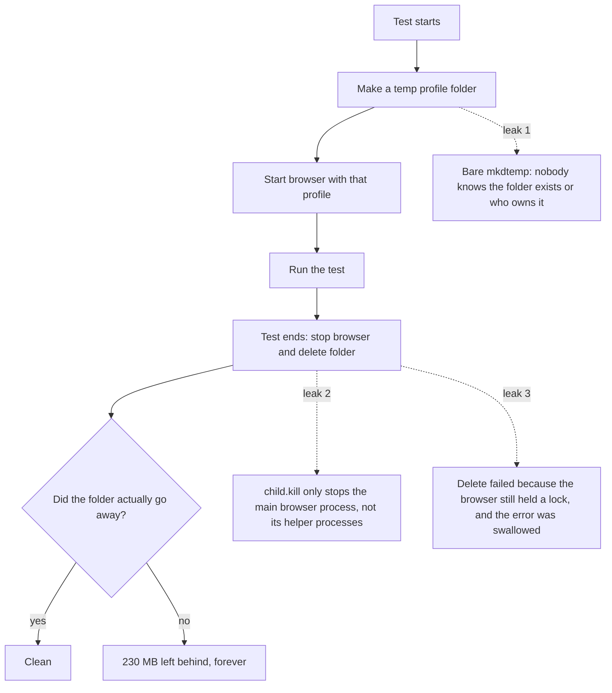
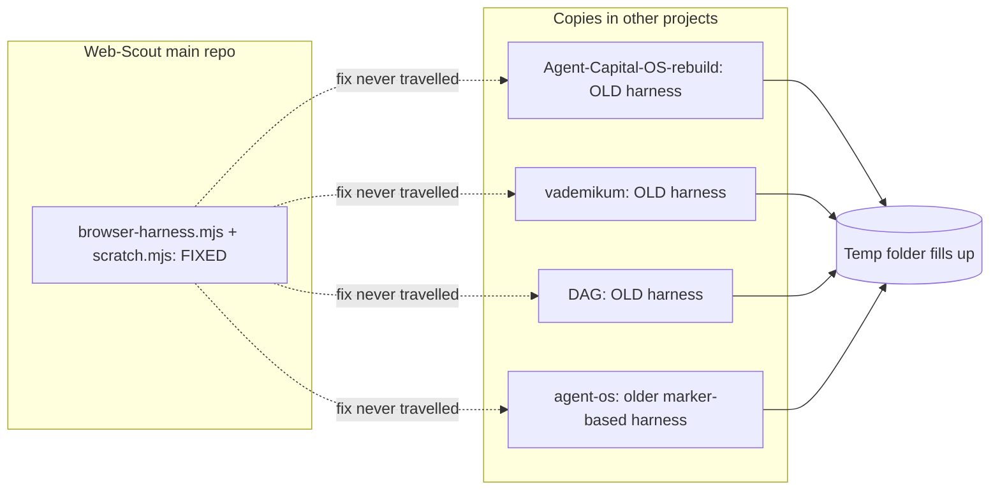
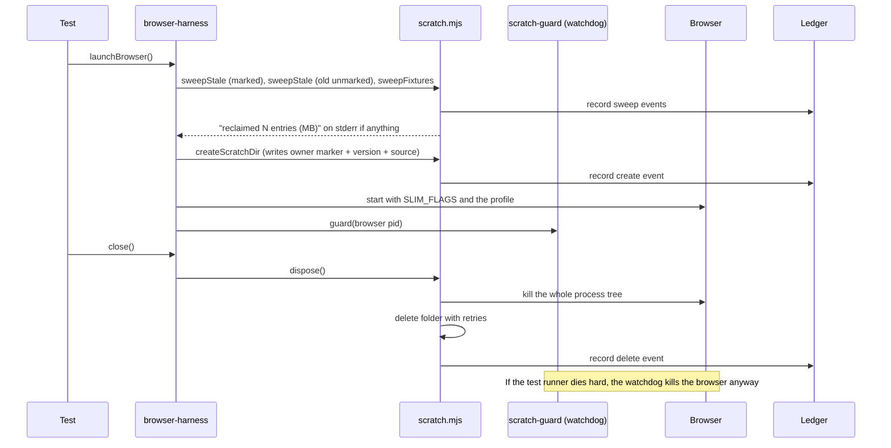
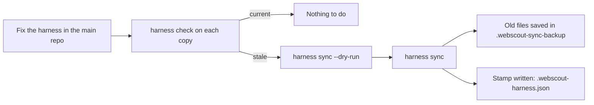

# The case of the vanishing disk: how a leaky test helper ate 19 GB, and how I made it stop

*7 October 2026*

It started with a number I did not like. I ran a disk scan on my machine and my temp folder was **6.1 GB**. Inside it were dozens of folders called `webscout-browser-profile-xxxxxx`, each one around 230 MB. My storage is limited, so this was not a theory problem. It was a "my disk is full and I do not know why" problem.

Those folders came from **Web-Scout**, the project I build. So I was the one who made the mess. This post is the story of finding out why, cleaning it up, and then (the part I care about most) changing the tool so the same mistake cannot quietly happen again.

I wrote it for people who use or want to build something like this, so I explain the reasoning as well as the result. You do not need to know Web-Scout to follow it. If you have ever launched a browser from a script or a test suite, the lesson applies to you.

The short version:

- Every browser launched by my test helper made a throwaway profile folder (about 230 MB). Old copies of the helper in sibling projects **never deleted them**.
- Cleanup of the leaked folders freed about **19 GB** (143 profile folders), and a first sweep of leftover test files freed another **558 MB** (1,019 entries).
- A browser profile can be about **8 MB** instead of 230 MB when you start the browser with the right flags.
- I added a way to **sync** the fixed helper into other projects, a way to **check** whether a copy is current, a stamp on every scratch folder saying who made it, an **age-based sweep** for old unmarked folders, a sweep for **test fixtures and logs**, and **loud reporting** when something was reclaimed.
- 13 files changed, one commit (`169d4ed`), and the full suite passes: **689 tests, 0 failures**.

---

## Contents

1. [The symptom](#1-the-symptom)
2. [Why a browser leaves a mess behind](#2-why-a-browser-leaves-a-mess-behind)
3. [The detective work: why my fix did not reach everywhere](#3-the-detective-work-why-my-fix-did-not-reach-everywhere)
4. [Cleaning up, safely](#4-cleaning-up-safely)
5. [The real lesson: a fix that does not travel is not a fix](#5-the-real-lesson-a-fix-that-does-not-travel-is-not-a-fix)
6. [The seven improvements](#6-the-seven-improvements)
7. [How the pieces fit together](#7-how-the-pieces-fit-together)
8. [Using it yourself](#8-using-it-yourself)
9. [Things that went wrong while building this](#9-things-that-went-wrong-while-building-this)
10. [What I would tell you if you are building something similar](#10-what-i-would-tell-you-if-you-are-building-something-similar)

---

## 1. The symptom

Here is roughly what the scan showed:

```
%TEMP%  (6.1 GB total)
 ├─ webscout-browser-profile-057ssC     ~230 MB
 ├─ webscout-browser-profile-0DwV3s     ~230 MB
 ├─ webscout-browser-profile-1Cf9nz     ~230 MB
 ├─ webscout-browser-profile-1RZMSm     ~230 MB
 ├─ ... dozens more ...
 └─ other stuff
```

When I ran the proper cleanup later, the real scale showed up: **143 leftover profile folders, 19,404 MB** (about 19 GB). The scan had only caught part of it, because some folders were still locked by running browsers.

A few things made this nasty:

- **It was invisible.** Nothing crashed. Tests passed. The only symptom was a slowly shrinking disk.
- **It grew with every test run.** Run the suite ten times, leak ten profiles.
- **It was spread across projects.** Several of my other projects carry their own copy of Web-Scout's test helper, and they were all leaking.

---

## 2. Why a browser leaves a mess behind

Some of my tests need a *real* page, so the test helper starts a real browser (Edge or Chrome) in headless mode and talks to it using the Chrome DevTools Protocol (CDP). A browser needs somewhere to keep its settings, cache and cookies. That place is called the **profile**, or "user data directory". To keep tests clean, I give each run a brand-new, empty profile in the temp folder, and I delete it when the run ends.

That sounds simple, and it is where three small mistakes hid. Think of it as three leaks in a pipe:



**Leak 1: an anonymous folder.** The old helper made the folder with a plain `mkdtemp`. That gives you a random name and nothing else. If the test crashed, no record said "this folder belongs to a run that is now dead, safe to delete".

**Leak 2: killing only the front door.** A modern browser is not one process. It is a family: a main process plus renderer, GPU and utility processes. `child.kill()` stops only the one you started. On Windows the others can keep running and keep files open. A folder with open files cannot be deleted.

**Leak 3: a swallowed error.** The cleanup used a `rmSync` wrapped so that failures were ignored. So when the delete failed because of leak 2, the helper shrugged and moved on. No error, no retry, no trace.

Each mistake alone is minor. Together they leak a whole profile on every run, silently.

---

## 3. The detective work: why my fix did not reach everywhere

Here is the twist that taught me the most. **I had already fixed this** in the main Web-Scout repository. The main copy of the helper:

- creates folders through a function that writes an **owner marker** (a small file saying which process owns the folder),
- kills the **whole process tree**, not just the root process,
- deletes with **retries** so a briefly-locked file does not defeat it,
- and runs a tiny **watchdog** process that kills the browser even if the test runner itself is killed hard.

But the folders on my disk were not being made by the main repo. They were being made by **older vendored copies**: when I started other projects, I copied Web-Scout's `tools/web-scout` folder into them. Each project carried a snapshot of the code *at the time of copying*. My later fix never reached those snapshots.



There was a second, quieter problem. The main repo's own cleanup at launch only looked at folders that carried the owner marker. The leaked folders came from old copies, so they had **no marker**, so the cleanup walked right past them. My safety rule ("only delete what I can prove is mine") was doing its job and leaving the mess in place.

This is a classic situation. The code was right in one place and wrong in four. Fixing the bug is only half the job. The other half is making sure the fix reaches everyone who needs it.

---

## 4. Cleaning up, safely

Before deleting anything I wanted to be sure about three things:

1. **Is a browser still using this folder?** If yes, leave it. A live run must never lose its profile.
2. **Is it really a Web-Scout folder?** Only folders matching the `webscout-browser-profile-` name are candidates.
3. **Can I see what would happen first?** The cleanup command has a dry-run mode that lists everything without deleting.

The result of the real cleanup:

```
removed 143 dir(s), 19404.6 MB
0 orphan browser process(es) killed
3 dir(s) kept (owner alive / too new)
0 failed (locked)
```

Note the "3 dirs kept". Those belonged to browsers that were still running, and the tool correctly left them alone. That is the behaviour I want: **when in doubt, do not delete.**

Then the user (me, in my other hat as the project owner) patched the three sibling projects with the fixed helper files, and the next launch reclaimed a further **1,019 leftover test fixtures worth 558 MB** (old test databases, server logs and so on that earlier runs never cleaned up). Temp usage dropped from **143 profile folders to 2**.

One note on process: copying files into other projects is the kind of action that should have a human say "yes". My assistant tooling asked for permission before overwriting other projects, was refused the first time, and did not try to sneak around it. I ran the copy myself. I like that this is how it went. Writing into somebody else's folder should never be a side effect.

---

## 5. The real lesson: a fix that does not travel is not a fix

After the cleanup I sat back and asked a different question: not "how do I fix this?" but "**what should the tool do so this never costs me 19 GB again?**"

I came up with five failure modes that let this happen, and one improvement for each:

| What went wrong | What would have caught it |
|---|---|
| The fix lived in one place, copies went stale | A command to push the fix into copies |
| I could not tell which version a folder came from | A version and source stamp on every folder |
| Old, unmarked folders were never reclaimed | An age-based sweep with safe rules |
| The cleanup happened silently | Loud messages and a ledger |
| Test leftovers other than profiles also piled up | A sweep for fixtures and logs |
| Nothing noticed a copy was out of date | A check command, plus a lint test |

On top of those I looked at the **size** of a profile too (improvement 5 in the next section).

---

## 6. The seven improvements

### Improvement 1: `harness sync`, one source of truth

A copy is only as good as the last time somebody refreshed it, so refreshing it should be one command:

```bash
node cli.mjs harness sync ../my-project/tools/web-scout
node cli.mjs harness sync ../my-project/tools/web-scout --dry-run   # preview only
```

It copies exactly three files, the ones that own browser and profile lifecycle:

- `browser-harness.mjs` (launches the browser and cleans up)
- `scratch.mjs` (the scratch folder lifecycle: create, own, sweep, delete)
- `scratch-guard.mjs` (the watchdog that kills the browser if the runner dies)

I kept the list small on purpose. These three files are **self-contained**. A copy that is many versions behind everywhere else can still take them without breaking. One dependency, `host-health.mjs` (a low-disk warning that only exists in a full checkout), is loaded *optionally*, so a copy without it still works.

Safety rules built into sync:

- It **refuses** to sync into the Web-Scout checkout itself.
- It **refuses** a folder that does not look like a Web-Scout copy, so a typo cannot scatter files into some random directory.
- Before overwriting any file it saves the old one under `.webscout-sync-backup/<timestamp>/`, because a copy might not be under git.
- It writes a small `.webscout-harness.json` stamp saying what was synced, from where, and when.

### Improvement 2: stamp every scratch folder

Every scratch folder now carries a marker with the **harness version** and the **source** it was created from. The ledger (a plain log file of create and delete events) records the same. So when a stray folder shows up, I can answer "which copy of the code made you?" instead of guessing.

### Improvement 3: sweep old unmarked folders (carefully)

This is the improvement that would have reclaimed the 19 GB on its own. At launch, the harness now also sweeps `webscout-browser-profile-*` folders that have **no marker**, but only if they pass both tests:

- **untouched for an hour or more**, and
- **no live browser is using them**.

The one-hour grace period matters. A younger unmarked folder might belong to a run happening right now in another project, and deleting a live run's profile would be worse than leaving some junk.

### Improvement 4: say it out loud

A silent cleanup hides problems. Now, when a launch reclaims anything, it prints one line to stderr, for example:

```
webscout: reclaimed 12 leftover scratch entries (2750 MB); 9 had no owner marker - an older vendored copy of the harness leaked them, re-run "node cli.mjs harness sync <project>"
```

That message does two jobs. It tells me something leaked, and it tells me **how to fix the cause**, not only the symptom. Each sweep is also written to the ledger as a `sweep` event so there is a history to look back at.

### Improvement 5: shrink the footprint (a decision not to build)

I considered a "template profile" (a pre-made profile copied for each run). Then I measured. With the browser started with a set of slimming flags (`SLIM_FLAGS`: tiny disk cache, no component updates, no sync, no extensions, no first-run work, no crash reporting), a fresh profile is about **8 MB**, compared with about 230 MB before. At 8 MB a template adds complexity for almost no gain, so I did not build it.

I think this is worth saying plainly: **sometimes the right improvement is a measurement that tells you not to build something.**

### Improvement 6: sweep fixtures and logs too

Profiles were the biggest offenders but not the only ones. Test runs also leave behind:

- fixture folders,
- `webscout-test-<pid>-<timestamp>.db` files (and their `-wal` / `-shm` companions),
- `webscout-serve-N.log`, `webscout-static-N.log`, `webscout-relay-<port>.log`.

A new `sweepFixtures` removes the ones older than 24 hours. It is deliberately cautious:

- it **skips the log of a relay that is still running** (it checks the relay's pid file),
- it **skips symlinks**,
- it **skips profile folders** (those have their own rules),
- it **skips the private temp root** a test run is currently using.

### Improvement 7: `harness check` plus a lint test

`harness check` answers one question: is this copy current?

```bash
node cli.mjs harness check ../my-project/tools/web-scout
```

It compares file hashes (SHA-256) between the canonical files and the copy, reports each file as `same`, `differs` or `absent`, and **exits with code 1 unless the copy is current**. That makes it usable in a script or a CI job.

I also added a lint test that reads the canonical harness and fails if anyone ever reintroduces the old mistakes, a bare `mkdtemp` or a lone `child.kill()`. A bug that has bitten once should become a test that fails the next time.

---

## 7. How the pieces fit together

The lifecycle of a scratch folder, after the changes:



And the "keeping copies honest" loop:



The layers of defence, from first line to last:

```
  1. Create with an owner marker        -> we know who owns it
  2. Kill the whole process tree        -> nothing holds a lock
  3. Delete with retries                -> short locks do not win
  4. Watchdog kills browser on SIGKILL  -> crashes do not strand a browser
  5. Sweep at next launch (marked)      -> clears yesterday's crash
  6. Sweep old unmarked folders         -> clears other copies' leaks
  7. Sweep fixtures and logs            -> clears the non-profile mess
  8. Loud report + ledger               -> a leak cannot stay hidden
  9. check + lint test                  -> a stale copy cannot stay hidden
```

No single layer is perfect. The point of stacking them is that a failure in one is caught by the next.

---

## 8. Using it yourself

If you run Web-Scout, these are the commands you will use:

```bash
# See what is in the scratch area, including legacy (unmarked) folders and fixtures
node cli.mjs scratch status

# Clean up. It shows what would go and asks before deleting.
node cli.mjs scratch cleanup

# Is a project's copy up to date? (exit 1 if not)
node cli.mjs harness check ../my-project/tools/web-scout

# Preview, then refresh the copy
node cli.mjs harness sync ../my-project/tools/web-scout --dry-run
node cli.mjs harness sync ../my-project/tools/web-scout
```

Two environment switches exist for special cases: `WEBSCOUT_NO_SWEEP=1` turns off the launch-time sweep, and the sweep is also skipped when `NODE_ENV=test` (tests get a private temp root instead, and the test runner fails the whole run if that root leaks anything).

If you are not using Web-Scout but build something similar, the patterns are portable:

1. **Mark what you create.** A tiny owner file (pid, time, version) turns "mystery folder" into "provably dead run's folder".
2. **Kill the tree, not the root.** On Windows especially.
3. **Never swallow a delete error.** Retry, then report.
4. **Sweep at startup,** with rules: old enough, owner gone.
5. **Version-stamp vendored copies** and make staleness checkable.

---

## 9. Things that went wrong while building this

I would be telling you half a story if I only listed the wins. These are the bumps:

- **Escaped backslashes vanished.** I generated part of a file through a shell heredoc and the regular expressions lost their backslashes, so the fixture sweep silently matched nothing. A test caught it, and I fixed the file with a proper edit.
- **An apostrophe broke a spec.** One string in the command spec contained an apostrophe and made the file fail to parse. I reworded the text.
- **A truncated test file.** An unterminated heredoc cut a test file short and left a stray command line inside it. I rewrote it, and in doing so switched it to use the project's own safe temp helper. That mattered, because my own new lint test (no bare `mkdtemp`) would have flagged the test file.
- **Generated docs went stale.** Adding commands changed the generated README command reference and the capabilities doc. Tests that compare generated files against the code failed until I regenerated them. That is the system working: the docs are not allowed to lie.
- **Two flaky tests, no root cause.** The first full run had five failures. Three were the stale docs above. Two others (a cleanup test over 200 folders and a health-endpoint test) passed on the next run and in a second full run. They may be sensitive to load. I do not have a root cause yet and I am saying so rather than pretending otherwise.

Final state: **689 tests, 0 failures**.

---

## 10. What I would tell you if you are building something similar

**Copies drift.** The moment you vendor code into another project, you own a second copy of every bug. Either avoid copying, or build the "refresh and verify" path on day one.

**Silent cleanup hides the disease.** My old cleanup was quiet, so the leaks never bothered me enough to investigate. A cleanup that reports what it found is also a detector.

**Be conservative in what you delete.** The three folders my cleanup kept were the best sign it was working. A temp cleaner that deletes a live run's data is worse than the clutter.

**Measure before you build.** The idea of a template profile died the moment I saw an 8 MB number.

**Turn every incident into a test.** The lint test, the check command and the fixture tests exist so this particular story does not repeat.

**Keep a human in the loop for cross-project writes.** Overwriting other projects' files is not something a tool should do on its own.

---

## Summary of the change

| | Before | After |
|---|---|---|
| Profile size per browser run | about 230 MB | about 8 MB |
| Leaked profile folders | 143 on my machine (about 19 GB) | 2 remaining after cleanup |
| Fixture and log leftovers | 1,019 entries (558 MB), never swept | swept after 24 hours |
| Old copies of the helper | stale, silent | `harness check` / `harness sync` |
| Unmarked folders | ignored forever | reclaimed after an hour if their owner is gone |
| Cleanup reporting | silent | stderr line + ledger `sweep` events |
| Regression protection | none | lint test on the harness + sync tests |

All of this landed as commit `169d4ed` (*feat(web-scout): harness sync/check, fixture sweep, and legacy-leak detection*), touching 13 files.

### What is still open

The helper copies in `Agent-Capital-OS-rebuild`, `vademikum` and `DAG` hold the earlier, smaller patch. They stop the leak, but they are stale against the newest files, and `agent-os` carries an older marker-based harness. One `harness sync` per project brings them all current. I will run those when I am ready to touch those projects.

If you take one thing from this post, let it be this: **the bug was fixed in one place on day one, and it still cost me 19 GB, because the fix never left the room.** Make your fixes travel.

Thanks for reading.
