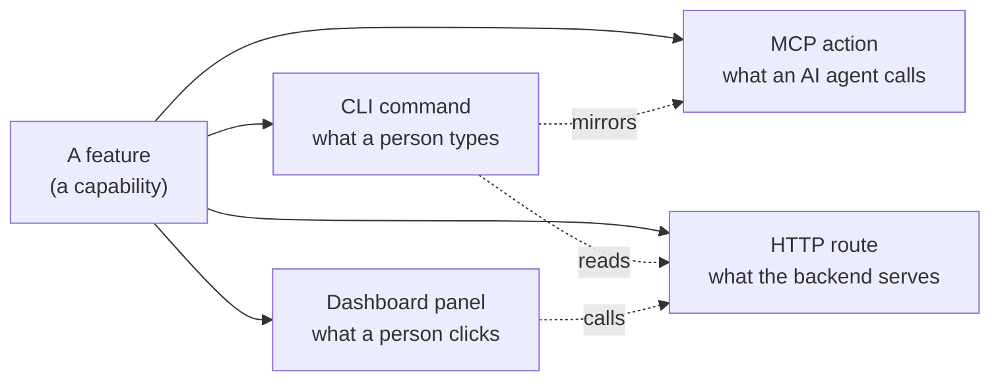
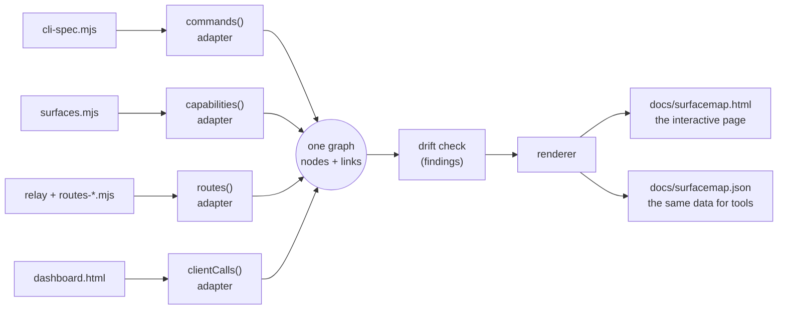
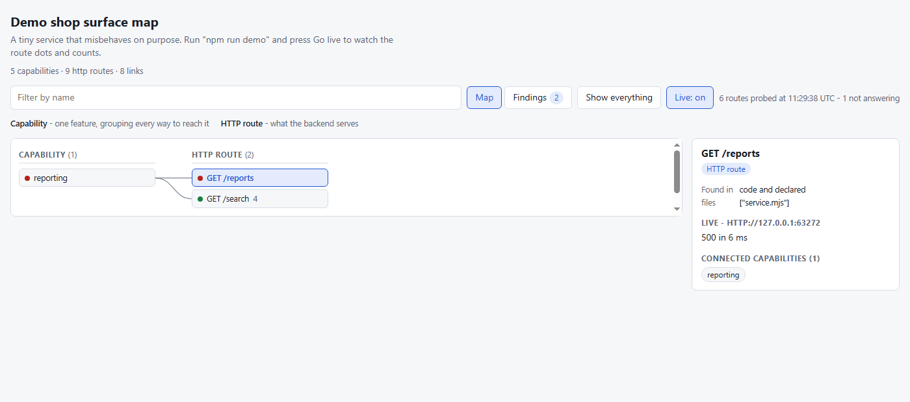
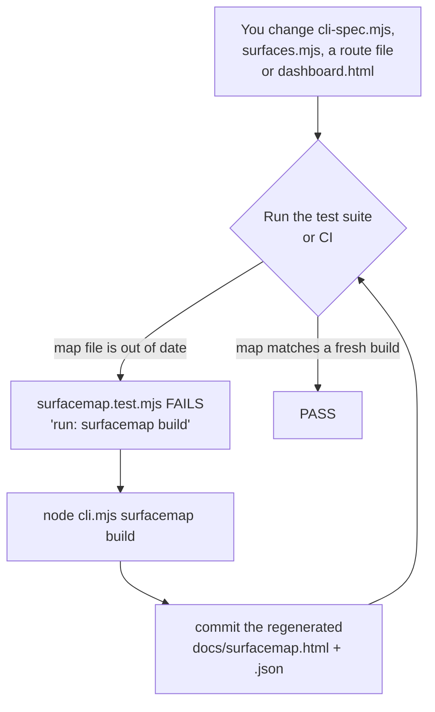
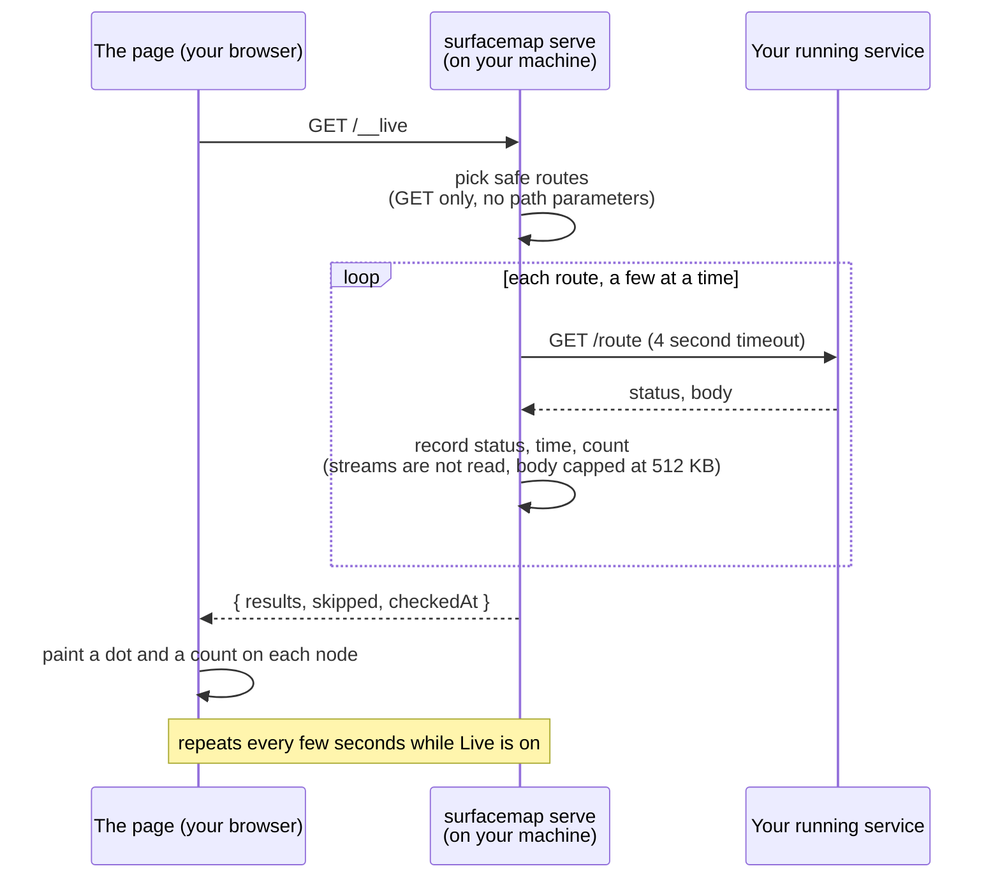
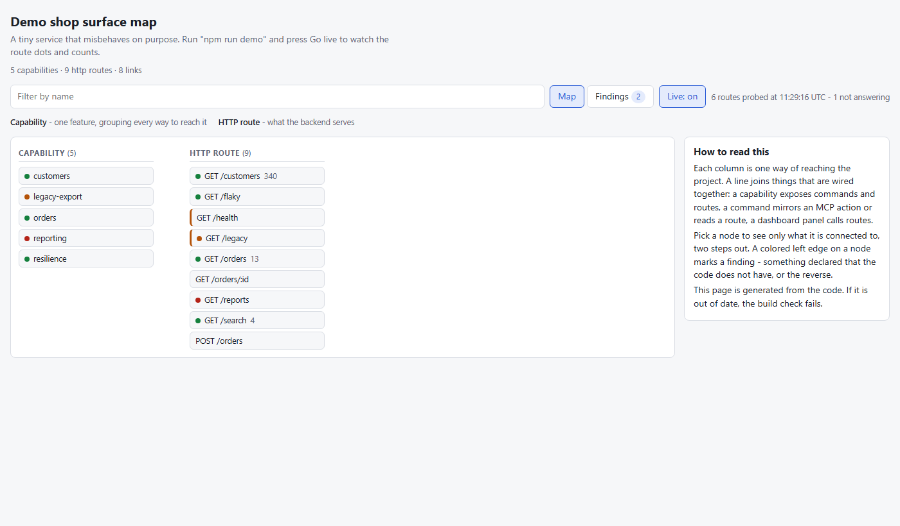
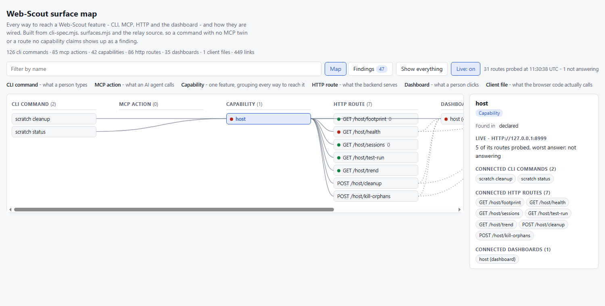
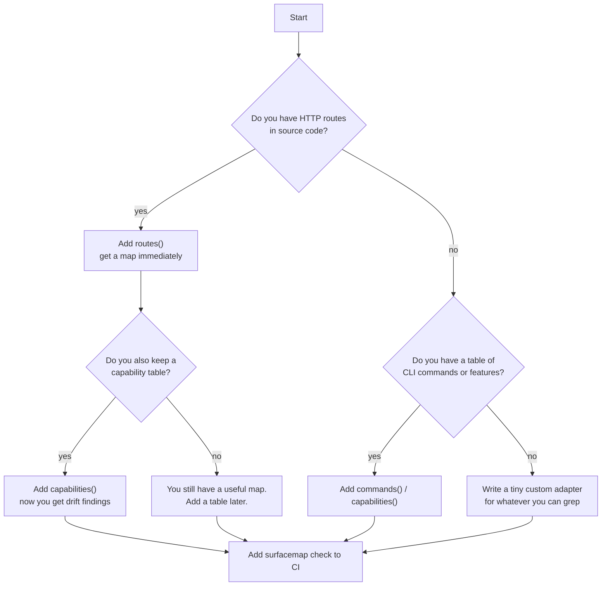

# A map of my project that cannot go stale: building surfacemap

*5 October 2026*

Every project I have worked on has the same quiet problem. At some point someone draws a diagram of how the pieces fit together. It is correct for about a week. Then a command is renamed, a route is added, a dashboard panel starts calling something new, and the diagram is wrong. Nobody notices, because a wrong diagram looks exactly like a right one.

This post is about how I stopped drawing that diagram and started *generating* it instead, and how that turned into a small reusable tool called **surfacemap**. It covers what I built, why I made each choice, what went wrong along the way, and how you can use it on your own JavaScript project. I tried to write it so that you do not need to know my project to follow it.

If you only want the short version:

- I have a project, **Web-Scout**, where every feature can be reached in up to four ways: a command-line command, an MCP action (what an AI agent calls), an HTTP route, and a dashboard panel.
- I built a tool that reads the real source files and builds an interactive page showing how all of those connect.
- A test fails when that page is out of date, so it stays true.
- A "live mode" also asks the running service whether each route is actually answering.
- It is now a separate, reusable project: <https://github.com/gungunfebrianza/adaptive-surfacemap>.

---

## Contents

1. [The problem: one feature, four doors](#1-the-problem-one-feature-four-doors)
2. [Why not just draw a diagram?](#2-why-not-just-draw-a-diagram)
3. [The idea: generate it from the code](#3-the-idea-generate-it-from-the-code)
4. [How the pieces fit together](#4-how-the-pieces-fit-together)
5. [Step by step: building it](#5-step-by-step-building-it)
6. [Putting it into Web-Scout, and why I copied the tool in](#6-putting-it-into-web-scout-and-why-i-copied-the-tool-in)
7. [Drift: when the code and the paperwork disagree](#7-drift-when-the-code-and-the-paperwork-disagree)
8. [Live mode: from "what should exist" to "what is answering"](#8-live-mode-from-what-should-exist-to-what-is-answering)
9. [The demo, and what it found on the real project](#9-the-demo-and-what-it-found-on-the-real-project)
10. [Two bugs worth telling you about](#10-two-bugs-worth-telling-you-about)
11. [Using surfacemap on your own project](#11-using-surfacemap-on-your-own-project)
12. [Honest limits](#12-honest-limits)
13. [What I would do next](#13-what-i-would-do-next)

---

## 1. The problem: one feature, four doors

Web-Scout is a tool with a local service at its centre, which I call the relay. A feature in it is rarely reachable only one way. Take almost any capability and you will find some mix of these:

| Door | Who uses it | Example |
|---|---|---|
| **CLI command** | a person at a terminal | `friction explain` |
| **MCP action** | an AI agent calling a tool | `webscout_meta.friction` |
| **HTTP route** | the dashboard, scripts, anything on the network | `GET /friction/notices` |
| **Dashboard panel** | a person clicking | the "Notices" panel |

The project is large enough that this adds up. At the end of this work the map contained **126 CLI commands, 85 MCP actions, 86 HTTP routes, 42 capabilities and 35 dashboard entries**, joined by roughly **450 links**. No one holds that in their head.

The questions that kept coming up were simple ones, and surprisingly hard to answer without grepping through several files:

- "I can do this from the CLI. Can an agent do it too?"
- "This route exists. Which command uses it? Does the dashboard?"
- "Did I forget to document the thing I just added?"

Here is the shape of the problem as a picture. One feature, several doors, and the links between them are what I wanted to see:



*What this diagram is for: it shows the core idea of the whole post. A capability has several doors, and some doors are really the same thing seen from a different side (a CLI command often mirrors an MCP action, and a dashboard panel calls an HTTP route).*

## 2. Why not just draw a diagram?

My first instinct, and probably yours, was to write a nice diagram in Markdown or a drawing tool and put it in the docs. I considered it seriously. I even sketched how I would organise a "visual documentation" folder with a flow diagram for each area, each one explaining its own purpose.

The trouble is not drawing it. The trouble is *keeping* it. A hand-made diagram has no connection to the code, so nothing can tell you when it stops being true. It rots silently.

I asked myself a more useful question: **what kind of interactive page does not go stale?** The answer I landed on is a page that has *no hand-made parts at all*. Every box and every line is computed from something that is already tested. If the page is wrong, a test should say so.

That one decision shaped everything else.

## 3. The idea: generate it from the code

Web-Scout already had two files that act as sources of truth, written by hand but guarded by tests:

- **`cli-spec.mjs`**, a table of every CLI command: how many arguments it takes, which flags it understands, and which MCP action mirrors it.
- **`surfaces.mjs`**, a table of capabilities: for each feature, which routes, commands and dashboard calls belong to it.

Plus the code itself:

- the relay's route files, which define the HTTP routes, and
- `dashboard.html`, which contains the calls the dashboard actually makes.

The plan was to read all four, combine them into one graph, compare what the tables *say* with what the code *has*, and draw the result. Because it is computed, it cannot quietly disagree with the code. And because a test rebuilds it and compares, even forgetting to regenerate gets caught.

Here is the pipeline, end to end:



*What this diagram is for: it is the whole machine in one picture. Four sources go in, each read by a small "adapter". They all write into one shared graph. A drift check looks for disagreements. A renderer then produces a single HTML file and a JSON file.*

## 4. How the pieces fit together

I want to explain the main concepts, because they are what make the tool reusable and not just a Web-Scout script.

### The graph

Everything is a **node** or a **link**:

- A **node** has a *kind* (cli, mcp, capability, http, dashboard, client), a *key* (like `GET /health`), and a note of where it came from: found in the **code**, found in a **declaration** (one of those tables), or both.
- A **link** joins two nodes and has a kind: `exposes` (a capability exposes a route), `mirrors` (a command has an MCP twin), `reads` (a command prints a route's answer), or `calls` (a dashboard panel or client file calls a route).
- A **finding** is a problem: a plain-language message, a severity (`warn` or `error`) and the nodes it is about.

### Adapters

An adapter is a tiny object that reads *one* source of truth and adds nodes and links to the graph. The four I wrote are:

| Adapter | Reads | Adds |
|---|---|---|
| `routes` | source files, using an "extractor" that knows how routes are written | HTTP route nodes, marked "found in code" |
| `clientCalls` | front-end files, such as a dashboard | one node per file, with links to the routes it calls |
| `commands` | a CLI spec table | CLI and MCP nodes, `mirrors` and `reads` links |
| `capabilities` | a capability table | capability and dashboard nodes, `exposes` and `calls` links |

The important design point is that **an adapter is just `{ name, run({ graph, root }) }`**. If your project has something greppable that I never thought of, such as a Postgres schema, an event bus or a job queue, you can write your own adapter in a few lines.

### Extractors

Finding routes in source is the part that depends on your coding style, so it is separated out. An extractor is a function from file text to a list of `"GET /path"` strings. I included several:

- `expressCalls` for `app.get('/x', handler)`
- `methodPattern` for Web-Scout's own style, `method: 'GET', pattern: /^\/x\/(\d+)$/`
- `apiCalls` for `api('GET', '/x')`, `fetchCalls` for `fetch('/x')`, and `axiosCalls`
- `literal` for the simplest case, plus your own function if none fit

A `${id}` inside a path becomes `:n`, query strings are dropped, and a path that is only known at run time is *skipped* rather than guessed. I would rather miss a link than draw a wrong one.

### Deterministic output

This detail does the most quiet work. The output has **no timestamps and no random ids**, and nodes are sorted. So building twice gives byte-identical files, and checking "is the committed map up to date?" is just: build in memory, compare to the file on disk. Line endings are ignored, so a Windows checkout does not cause false alarms.

## 5. Step by step: building it

Here is the order I worked in, with the reasoning at each step. It is roughly how I would recommend approaching something similar.

**Step 1: Decide it should be a separate tool.**
I started with "a diagram for Web-Scout" and then asked whether it could be one app other JavaScript projects could use. It could, because almost nothing about the idea is Web-Scout-specific. Only two things are: how its routes are written, and its configuration. So I built a standalone tool and made Web-Scout its first user. I picked the name **surfacemap**, because the thing it shows is a project's *surfaces* (the ways of reaching it) and how they connect.

**Step 2: Scaffold the core.**
A zero-dependency Node project (Node 20 or newer), ESM modules, `node --test` for tests. I wrote the graph model first, then the drift check, the renderer and a small CLI (`init`, `build`, `check`, `findings`). Zero dependencies was deliberate. A tool that other projects install should not drag a tree of packages in with it.

**Step 3: One page, drawn in the browser.**
The renderer fills an HTML template and inlines the graph as JSON. A small script in the page draws it: one column per kind, a button per node, and when you pick a node, the board narrows to everything within two steps of it, with curved lines for each link and a detail panel on the right. There is a filter box, a Findings tab, links you can share (`#http:GET /health` opens directly on that node), Escape to clear, and dark mode.



*What this picture is for: it shows the "narrowing" behaviour. I picked one route. The page shows only what it is wired to, draws lines to it, and explains it in the panel on the right.*

**Step 4: Add the `clientCalls` adapter.**
At first the map knew what the dashboard *declared* it called, but not what it *actually* called. The new adapter reads `dashboard.html`, finds the real `api('GET', '/x')` and `fetch` calls, and links them. Now two kinds of mistake can be caught: a panel claims a route that no client code calls, and a client calls something no panel declares.

**Step 5: Hook it into Web-Scout.**
I wrote a config file wiring the four adapters to the real files, and a test (next section explains why that test matters most).

**Step 6: Make it easy to run.**
I added `surfacemap build`, `surfacemap check` and `surfacemap serve` to Web-Scout's own CLI. Without that you type a long path into a vendored folder. With it, it is one short command like any other.

**Step 7: Add live mode, then a demo.**
That is sections 8 and 9.

**Step 8: Publish the tool.**
The code lives at <https://github.com/gungunfebrianza/adaptive-surfacemap>. It is not on the npm registry yet.

## 6. Putting it into Web-Scout, and why I copied the tool in

This is the step people ask about most, so it deserves a proper explanation.

Web-Scout's automated checks run on a hosted machine that checks out *only the Web-Scout repository*. There is no `package.json` and no install step. If I made surfacemap an npm or git dependency, the checks would have nothing to fetch and would fail.

So I **vendored** it: I copied surfacemap's `bin/` and `src/` folders into `vendor/surfacemap/` inside Web-Scout. A short README there records exactly which surfacemap commit the copy came from and says "do not edit these in place; change surfacemap, then copy over".

That is a trade-off, not a free win:

| | Vendored copy | npm / git dependency |
|---|---|---|
| Works in CI with no install | **yes** | no |
| Easy to update | no, copy again by hand | yes |
| Risk of the copy falling behind | yes (it is a pinned commit) | lower |

For a project with no install step the first row decides it. If your project already runs `npm install` in CI, a normal dependency is the better choice.

The part that keeps the whole thing honest is one small test file in Web-Scout, `surfacemap.test.mjs`. It checks three things:

1. the configuration still finds the relay, the spec, the capabilities and the dashboard (so a broken path cannot make the map quietly empty),
2. there are no **error-level** findings, and
3. the committed `docs/surfacemap.html` and `.json` are identical to a fresh build.

Here is what that gives you in daily use:



*What this diagram is for: it is the loop that stops the documentation going stale. You cannot merge a change that moves a command or route without also refreshing the map, because the test will not let you.*

The honest result on the first real run: **371 nodes, 446 links**, and **47 warnings**. (After adding the new CLI commands, the map grew to 375 nodes and 449 links, with the same 47 warnings.) I did not hide the warnings, which brings me to drift.

## 7. Drift: when the code and the paperwork disagree

"Drift" is my word for the places where what a person *declared* and what the code *has* stop matching. The tool reports these as findings:

| Finding | Meaning |
|---|---|
| `declared-not-in-code` | a table names a route or command that the code does not have |
| `in-code-not-declared` | the code has something no capability claims |
| `cli-without-mcp` | a CLI command has no MCP twin and no stated reason |
| `gap-without-reason` | a capability leaves a door empty and does not say why |
| `declared-call-not-in-client` | a dashboard panel claims a call no client file makes |
| `client-call-undeclared` | a client file makes a call no panel declares |
| `file-not-found` | a configured file pattern matched nothing (this one is an **error**) |

Only kinds that *can* be compared are checked. If you add just the `routes` adapter and no declaration table, you get a map and no findings, rather than a wall of noise. That lets you adopt one adapter at a time.

The 47 warnings on Web-Scout are real. They are CLI commands (`dom *`, `idb *`, `net *`, `relay *` and others) that exist in `cli-spec.mjs` but are not claimed by any row in `surfaces.mjs`. I chose to leave them visible as honest output rather than invent groupings just to make the number zero. Warnings do not fail the build; only errors do, and you can choose to fail on warnings too (`--fail-on warn`).

One small episode shows why this is useful. When I added the three new `surfacemap` commands to the CLI, the map immediately raised a warning: my new capability had no HTTP route and gave no reason. I added a one-line explanation ("a maintainer tool run on the checkout, not served by the relay") and the warning went away. The tool caught my own omission in the same session I introduced it.

## 8. Live mode: from "what should exist" to "what is answering"

The map answers "what is *supposed* to exist". It cannot tell you whether the service running right now actually has it. That gap is what **live mode** is for.

You start it with `surfacemap serve`. That runs a small local web server which serves the same page, rebuilt from your files each time you load it, and adds a **Go live** button. When switched on, each route gets a coloured dot:

- **green**: answering normally
- **amber**: the service answered with a 4xx (a client error such as 404)
- **red**: a 5xx error, or no answer at all

Where the answer is a list, it also shows a count (`/orders` returning 13 entries shows 13). A capability shows the *worst* result among its routes, so you can scan the capability column and spot a problem without opening anything.

### Where the probing happens, and why

I made one design choice here that I want to explain, because the obvious approach is wrong. The obvious approach is to let the page call your service directly from the browser. I did not do that, for two reasons:

1. **Browsers block it.** A page opened from disk, or served from another port, is not allowed to read responses from your service unless the service sends special "CORS" headers. Web-Scout's relay does not.
2. **Streams hang.** Some routes never finish (server-sent events keep the connection open forever). A browser waiting on one of those would stall.

So the probing happens in the `serve` process on your machine, and the page only asks that process what it found:



*What this diagram is for: it shows who talks to whom. The browser never touches your service. The local `serve` process does the probing and hands back a small summary.*

### Safety rules

A tool that calls your service deserves strict rules, so these are built in and tested:

- **Only GET is ever sent.** Never POST, PUT or DELETE.
- **Only routes with no path parameters** (`/orders`, not `/orders/:id`), because there is nothing safe to fill in.
- Each call has a **4 second timeout** (adjustable), event streams are **not read**, and bodies **stop at 512 KB**.
- The server listens on **127.0.0.1 only**.
- The built file never contains the live switch, so a normal `build` stays deterministic and `check` is unaffected.
- Everything it skips is listed in the detail panel as "Not probed", with the reason, so nothing is hidden.

One honest caveat: a `GET` route in *your* service that changes state would still change it when probed. The tool cannot know. If you have any, put them in `live.exclude`.

## 9. The demo, and what it found on the real project

Telling you it works is weaker than showing it. So I built a demo: a tiny fake shop service that misbehaves on purpose, so live mode has something interesting to display. Run it with `npm run demo`.

The fake service does this:

| Route | Behaviour |
|---|---|
| `/orders` | grows by one entry every few seconds, so its count moves |
| `/customers` | always reports a total of 340 |
| `/reports` | always fails with a 500 |
| `/search` | answers slowly (about 0.9 seconds) |
| `/flaky` | fails every third call |
| `/legacy` | is declared in the capability table, but the service does not serve it (404) |

And this is the real page, in a real browser, with live mode on:



*What this picture is for: it is the payoff. Green dots are healthy routes (counts shown next to them), the red dot is `/reports` failing, and the amber dot is `/legacy` returning 404. Notice the capability column on the left too: `reporting` is red because one of its routes is, and `legacy-export` is amber. You can see the health of every feature without clicking anything.*

I also pointed it at the real Web-Scout. The first thing I found was a surprise. The relay already running on my machine's usual port turned out to be an **older copy** of Web-Scout from a different folder. It had no `/host/*` routes at all, so those showed amber (404). That is exactly the situation live mode exists to catch: the map was built from one checkout, and the thing listening on the port was a different version.

To get a clean reading, I started the relay from the current checkout on a spare port, with throwaway data, and probed that:



*What this picture is for: it is the real project, not the demo. The `host` capability is selected. Most routes are green with counts, and one is red.*

Of the 31 routes probed there, **26 returned 200**, three returned 400 (they need query arguments I do not send), one returned 404, and one timed out. The timeout was `/host/health`, which does real work and takes longer than the default 4 seconds. I raised Web-Scout's probe timeout to 10 seconds for that reason. I did not re-run the probe after changing it, so I will not claim it now passes.

## 10. Two bugs worth telling you about

I like writing these down, because both were caught by checking rather than assuming.

**The injection hole.** The map embeds its data as JSON inside an HTML `<script>` tag. If a route name ever contained `</script>`, it would close the tag early and anything after it would run as code. I escaped the `<` character, but my first version of that escape was written with a single backslash, so it did not escape anything. A test I had written specifically to try this attack failed, and that is how I found it. The fix was to build the escape in a way that cannot be mangled. The lesson: when a piece of security-relevant code looks right, write the attack as a test.

**The invisible backspace.** When I added `?live`, a shortcut that starts probing the moment the page loads, it did nothing. The code looked right. The screenshot showed the button still saying "Go live". I dumped the page and found the cause: the character after `live` in my regular expression was not `\b` (a word boundary) but a literal *backspace character*, because my tooling had interpreted the escape and written the raw character into the file. It was invisible in the editor. I fixed it, and added a test that fails if the template ever contains a stray control character. Both of these were found by actually looking at the output in a browser, not by trusting the code.

## 11. Using surfacemap on your own project

This is the part for you. You need **Node 20 or newer**. There are no other dependencies.

### 1. Get it

It is not on the npm registry yet. Clone it from <https://github.com/gungunfebrianza/adaptive-surfacemap>, or copy its `bin/` and `src/` folders into your project (this is what Web-Scout does). A direct install from GitHub, `npm i github:gungunfebrianza/adaptive-surfacemap`, should also work, but I have not tested that route.

### 2. Make a config

```sh
surfacemap init
```

That writes a starter `surfacemap.config.mjs`. Here is a complete, minimal one for an Express-style app:

```js
import { defineConfig } from 'surfacemap';
import { routes, extractors } from 'surfacemap/adapters';

export default defineConfig({
  project: 'my-app',
  purpose: 'How the ways of reaching my app connect.',
  out: 'docs/surfacemap',
  adapters: [
    routes({ files: ['src/routes/*.js'], extract: extractors.expressCalls }),
  ],
});
```

### 3. Build it and look

```sh
surfacemap build      # writes docs/surfacemap.html and docs/surfacemap.json
```

Open the HTML file in a browser. That is already useful: you have a searchable map of every route.

### 4. Add more adapters as you need them

Start small and grow. Each one you add makes the map richer:

```js
adapters: [
  routes({ files: ['src/routes/*.js'], extract: extractors.expressCalls }),
  clientCalls({ files: ['public/app.js'], extract: (src) => [...extractors.fetchCalls(src)] }),
  commands({ rows: CLI_SPEC }),            // if you keep a table of CLI commands
  capabilities({ rows: [ /* your feature table */ ] }),
],
```

A capability row looks like this. It says "this feature is reachable through these routes and commands, and if a door is empty, here is why":

```js
{ id: 'orders',
  http: ['GET /orders', 'POST /orders'],
  cli: null,       cliWhy: 'web only',
  dashboard: null, dashboardWhy: 'no UI yet' }
```

The `...Why` fields are the review trail. They force the question "where can someone reach this?" to be answered in writing.

### 5. Guard it in CI

```sh
surfacemap check
```

This exits with code 1 when the committed map is stale or when findings reach your chosen severity (`--fail-on error` by default, or `--fail-on error,warn` to be strict). Add it as a CI step, or call it from a test like Web-Scout does.

### 6. Optionally, go live

```sh
surfacemap serve --target http://127.0.0.1:3000
```

Open the printed address with `?live` on the end. If your project has any `GET` route that changes state, list it so it is never called:

```js
live: { target: 'http://127.0.0.1:3000', exclude: [/^GET \/admin/], timeoutMs: 4000 }
```

### The fastest way to see it first

Before wiring anything up, run the demo, which needs no project of your own:

```sh
git clone https://github.com/gungunfebrianza/adaptive-surfacemap
cd adaptive-surfacemap
npm run demo
```

Then open the address it prints, add `?live` to the end, and watch the dots.

### How to choose where to start



*What this diagram is for: it helps you pick a starting point. The key idea is that you do not need everything at once, and you only get drift warnings once there are two sides to compare.*

## 12. Honest limits

I would rather tell you the weak spots than have you find them.

- **It reads source text with regular expressions; it does not run your program.** A route registered in an unusual way, or a path built at run time, will not be seen. A clean map means "everything *it could read* agrees", not "everything in the project is covered".
- **Drift needs two sides.** With only routes found in code, there is nothing to compare against, so you get a map but no findings.
- **The 47 warnings on Web-Scout are real and still open.** I left them visible instead of faking tidiness. They are only useful if someone eventually fixes or declares them.
- **Live mode shows nothing your service's own health check does not.** Its value is the per-route, per-capability view and catching a mismatched version. It is a local tool, not something that runs in CI.
- **Vendoring means copying.** Web-Scout's copy is pinned to an older surfacemap commit and does not yet have the newest page features (the `?live` shortcut). It has to be re-copied by hand.
- **Not on npm, and not widely tested.** It has been used on one real project and one demo. Expect rough edges on a project with different conventions.
- **A note on the testing.** The tool's own suite has 26 passing tests, and the Web-Scout map checks pass. The full Web-Scout suite (680 tests) has one *local* complaint: a leak check that notices leftover browser profile folders in my machine's temp directory, left by processes outside the test run. I expect the clean hosted runner not to have them, but I have not seen that result, so I am not claiming it.

## 13. What I would do next

- **State machines.** Some features behave like a small state machine (a notice that can be snoozed, reviewed, then closed). I would like the map to draw those from the same table the code uses.
- **Test links.** Each node could point at the test that proves it, so "is this covered?" becomes a click.
- **Publish to npm**, so the vendoring workaround is only needed by people who want it.
- **Close the 47 warnings** by deciding, command by command, which capability they belong to.

---

## The short version, again

I started with a question I could not answer quickly: *how does everything in my project connect?* Drawing a diagram would have answered it for a week. Instead I built a small tool that reads the code and the tables a project already keeps, draws the connections, tells you when the paperwork and the code disagree, and refuses to let the picture go stale because a test compares it to a fresh build. Then I added a way to check the picture against the running service.

If you try it, I would like to hear what your project's routes and conventions look like, especially if the extractors miss them. Writing a new extractor is a few lines, and the ones that exist today came from exactly that kind of gap.

The code is here: <https://github.com/gungunfebrianza/adaptive-surfacemap>
